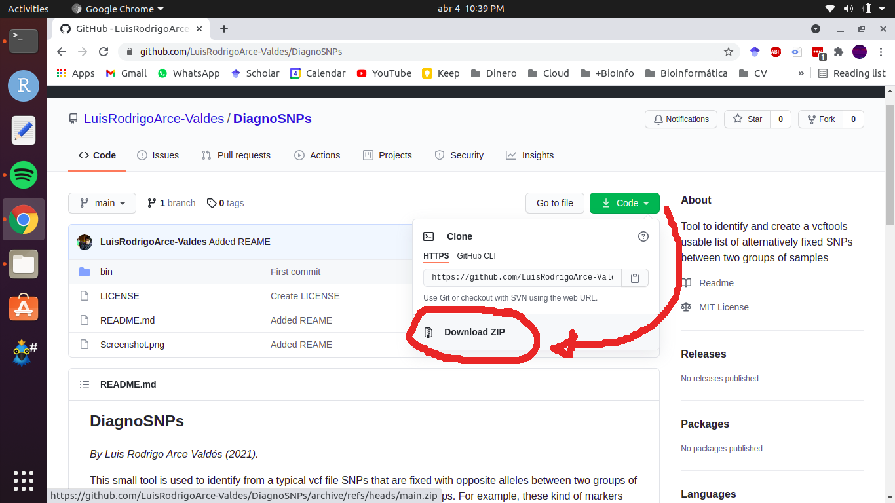

## DiagnoSNPs
*By Luis Rodrigo Arce Valdés (2021).*

This small tool is used to identify from a typical vcf file SNPs that are fixed with opposite alleles between two groups of samples. These markers then, can be used as diagnostic for those two groups. For example, these kind of markers are widely used in hibrization studies to identify species specific alleles and then quantify the degree of hibridization and introgression in hybrid samples.

### Download and Installation
#### Dependencies
This program works on any UNIX command line terminal. However, you need first to install [vcftools](https://vcftools.github.io/index.html) and [R](https://www.r-project.org/) software on your computer. For vcftools I highly suggest you to install it via conda. You might want to install [miniconda](https://docs.conda.io/en/latest/miniconda.html), the minimal version of conda and then install vcftools via:
```
conda install -c bioconda vcftools
```
Install the latest version of R from the terminal using:
```
sudo apt install r-base
```

#### Downloading DiagnoSNPs
To install DiagnoSNPs simply download this whole repository using the green code button and then clicking on **Download ZIP**.



Alternatively you can git clone this repository at a specific directory using:
```
git clone git@github.com:LuisRodrigoArce-Valdes/DiagnoSNPs.git
```

#### Soft Installation

This soft installation temporarily edits your `$PATH` variable to add the DiagnoSNPs scripts; however this change is applied on your current session only. So, if you close your terminal or open a new window you will need to run this steps again.

1. Position yourself inside the `DiagnoSNPs/bin` directory using a terminal. For example `cd bin` if you are in the directory where this README is saved.
2. Run the following command:
```
export PATH=$PATH:$(pwd)
```
3. Change to another directory (For example: `cd ../../`) and run the following command:
```
DiagnoSNPs.sh
```
If the program manual has appeared on your terminal, you have installed DiagnoSNPs correctly!

#### Hard Installation

The hard installation adds the DiagnoSNPs bin directory to your `$PATH` each time you open a new session. Which means you will be able to run the scipt anytime that you want to do it, without worrying to install it again!

1. Open the `.bashrc` file in your home directory (for example, /home/your-user-name/.bashrc) in a text editor. I suggest you to use the nano editor; as an example: `nano ~/.bashrc`.
2. Add `export PATH="$PATH:[DiagnoSNPs/bin directory]"` to the last line of the .bashrc file, where [DiagnoSNPs/bin directory] is the absolute route to the DiagnoSNPs bin diretory.
3. Save the .bashrc file.
4. Restart your terminal.

You may test the current installation of the program with:
```
DiagnoSNPs.sh
```
### Running the program
To run DiagnoSNPs simply run the following command:
```
DiagnoSNPs.sh -v vcf -a first_group.txt -b second_group.txt -o dir -p prefix
```
where:

-v: path to the vcf input file.

-a: path to a text file with the samples names of the first group.

-b: path to a text file with the samples names of the second group.

-o: path to a directory where to write the output file.

-p: prefix for output file.

For both samples names text files the format is simply a sample name per new line:

```
sample1
sample2
sample3
...
samplen
```
